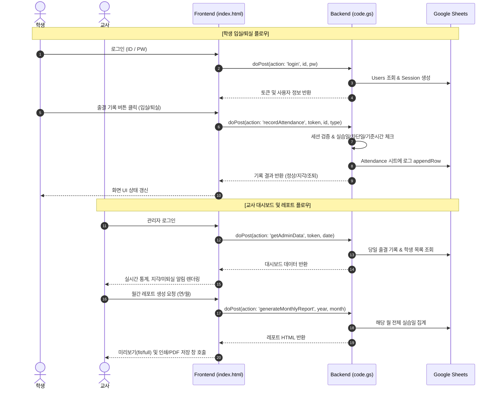

# [PRD] 2026 Doje Beacon System (도제반 출결 관리 시스템)

## 1. 프로젝트 개요 (Overview)
- **프로젝트 명**: 2026 Doje Beacon System (성일정보고등학교 도제반 3-12 출결 관리 시스템)
- **문서 버전**: v1.0.0
- **작성일**: 2026-08-19
- **개발/운영 환경**:
  - **Frontend**: Pure HTML5, CSS3, Vanilla JavaScript (Single Page Application, Zero-CDN 폐쇄망 대응)
  - **Backend**: Google Apps Script (GAS) Web App (`code.gs`)
  - **Database/Storage**: Google Spreadsheets (`Users`, `Attendance`, `BlockedDates`, `Sessions` 시트), PropertiesService (`Script Properties`)
  - **Config**: `project26_05_gas_url.json` (API 엔드포인트 설정)
  - **Vendor Libraries**: Flatpickr v4.6.13, Pretendard Variable Font (자체 호스팅)

---

## 2. 문제 정의 및 개발 목적 (Background & Objectives)
1. **배경**:
   - 직업계고 도제반 학생들은 화·수·목요일 기업 현장실습에 참여하며, 기업별로 출퇴근 기준시간(예: 09:00~18:00, 08:30~17:30 등)이 상이함.
   - 대리 출석, 무단 지각/조퇴, 미퇴실 등의 이슈를 방지하고 실시간 모니터링이 필요함.
   - 학교 네트워크 및 모바일 환경에서의 안정적인 구동과 교사의 월간 출석부(PDF 레포트) 취합 자동화가 요구됨.

2. **목표**:
   - **학생**: 모바일/PC에서 간편하게 입실/퇴실을 인증하고 본인 출결 현황 확인.
   - **교사**: 실시간 출결 모니터링, 지각/미퇴실/미입력자 즉시 식별, 학생 계정 및 기준시간 관리, 공휴일 및 차단일 설정, 월간 출석 레포트 자동 생성/인쇄.
   - **보안/안정성**: Salt+Pepper 기반 비밀번호 암호화, 세션 토큰 검증, 브루트포스 잠금, 전역 스크립트 잠금(동시성 제어), CDN 비의존성(외부망 차단 대비).

---

## 3. 사용자 및 권한 체계 (User Roles & Permissions)

| 구분 | 역할 (Role) | 주요 기능 및 권한 |
| :--- | :--- | :--- |
| **학생** | `학생` | • 본인 계정 로그인 및 최초 초기 설정 (비밀번호 변경, 기준시간 확인/설정) • 당일 입실/퇴실 출결 기록 • 본인 비밀번호 변경 • 당일 출결 상태 및 기준시간 확인 |
| **교사 (관리자)** | `교사` | • 교사 계정 로그인 • 일별 출결 대시보드 실시간 모니터링 (통계, 미퇴실/지각자 알림, 출결 목록) • 학생 계정 관리 (등록, 수정, 삭제, 임의 초기 비밀번호 발급/초기화) • 출결 차단일 관리 (공휴일 확인, 실습일 수동 차단/해제) • 월간 출석 레포트 생성 및 인쇄/PDF 저장 • 구글 시트 전용 메뉴 지원 (교사 비밀번호 초기화, 지난 날짜 행 숨기기/보이기, 만료 세션 정리, 자동 정리 트리거 등록) |

---

## 4. 핵심 기능 요구사항 (Functional Requirements)

### 4.1. 공통 및 인증/보안 시스템
1. **설정 동기화 (`getConfig`)**:
   - 프론트엔드는 초기 구동 시 백엔드로부터 실습 요일, 공휴일, 지각 유예시간, 퇴실 잠금시간 등의 비즈니스 규칙을 수신하여 기준 통일.
2. **로그인 (`login`)**:
   - 학번/ID 및 비밀번호 입력.
   - 5회 실패 시 5분간 계정 잠금 처리 (Brute-force 방어).
   - 솔트(계정별 무작위)+페퍼(스크립트 속성) HMAC-SHA256 2000회 반복 해싱 검증.
   - 레거시 계정(평문/단일 SHA-256) 로그인 시 신규 암호화 체계로 자동 승급(Auto-upgrade).
   - 로그인 성공 시 UUID 기반 세션 토큰 발급 (`Sessions` 시트에 기록, 유효기간 30분).
   - '아이디 저장' 기능 지원 (LocalStorage에 ID만 보관, 비밀번호 저장 금지).
3. **최초 초기 설정 (`initialSetup`)**:
   - 신규 등록 계정 또는 비밀번호 초기화 계정은 최초 로그인 시 비밀번호 변경 강제.
   - 학생의 경우 입실/퇴실 기준시간 설정.
   - 기존 초기 비밀번호(0000, 1234 등)로의 재설정 방지.
4. **비밀번호 변경 (`changePw`)**:
   - 학생 화면 상단에서 현재 비밀번호 확인 후 새 비밀번호(4~50자)로 변경.
5. **세션 및 보안 관리**:
   - 클라이언트 비활성 30분 감지 시 자동 로그아웃 (`SESSION_TIMEOUT`).
   - 서버 측 요청마다 세션 토큰 및 권한(Role) 유효성 검증.
   - 백그라운드 탭 전환 시(`visibilitychange`) 자동 새로고침 중지하여 GAS 할당량 보호.

---

### 4.2. 학생 출결 기능 (`studentSection`)
1. **OJT 기간, 실습일 및 차단일 검증**:
   - **OJT 운영 기간**: 매년 **3월 1일 ~ 12월 31일**에만 현장실습이 진행되며, **1월과 2월은 OJT 비운영 기간**으로 출석 버튼이 비활성화되고 안내 문구가 표시됨.
   - **현장실습 요일**: 화·수·목(`FIELD_DAYS = [2, 3, 4]`) 외 요일은 출석 버튼 비활성화 및 안내 문구 표시.
   - **공휴일 및 차단일**: 법정 공휴일 및 교사가 설정한 수동 차단일에는 출석 차단 안내 및 버튼 비활성화.
2. **입실 기록 (`recordAttendance - 입실`)**:
   - 당일 1회만 기록 가능.
   - 학생별 입실 기준시간(`IN_TIME`) + 20분(`LATE_GRACE_MINUTES`) 초과 시 '지각' 판정, 이내일 경우 '정상' 판정.
3. **퇴실 기록 (`recordAttendance - 퇴실`)**:
   - 입실 기록이 먼저 완료되어야 활성화.
   - **퇴실 최소 대기시간 락**: 입실 기준시간 기준 2시간(`OUT_UNLOCK_AFTER_MINUTES = 120분`) 이후 활성화 (남은 시간 카운트다운 표시).
   - 퇴실 기준시간(`OUT_TIME`) 이전에 퇴실 기록 시 '조퇴' 판정, 이후는 '정상' 판정.
4. **모던 UI 및 실시간 상태 피드백**:
   - **실시간 디지털 시계 (`HH:MM:SS`) & 날짜 캡슐 배지**: 초 단위 라이브 시계 제공.
   - **학생 프로필 글래스 카드**: 학생 아바타, 이름, 현장실습생 배지 및 입/퇴실 기준시간 그리드 분리 카드.
   - **고급 마이크로 인터랙션 버튼**:
     - **입실 버튼**: 에메랄드 그린 그라디언트 + SVG 도어 아이콘 + 글로우 호버 인터랙션.
     - **퇴실 버튼**: 앰버 오렌지 그라디언트 + SVG 도어 아이콘 + 글로우 호버 인터랙션.
     - **완료 상태 (`btn-done`)**: 소프트 민트 틴트 완료 카드 + 체크 아이콘.
     - **대기/잠금 상태 (`btn-lock`)**: 쿨그레이 락 카드 + 실시간 잔여시간 카운트다운.

---

### 4.3. 교사 대시보드 (`adminSection` -> `tab-dashboard`)
1. **일별 출결 모니터링**:
   - Flatpickr 기반 날짜 선택 및 이전/다음일 내비게이션.
   - 상단 요약 카드: 입실 완료 인원, 퇴실 완료 인원, 지각 인원, 조퇴 인원의 4개 모던 글래스모피즘 카드 구성.
2. **대시보드 서브 탭 (확인 필요 / 기록 상세)**:
   - **[⚠️ 확인 필요] 탭**:
     - **입실 미입력 학생**: 당일 입실 기록이 아직 없는 학생 명단 (인터랙티브 칩 버튼 스타일).
     - **퇴실 미입력 학생**: 당일 퇴실 기록이 아직 없는 학생 명단 (인터랙티브 칩 버튼 스타일).
     - **지각 학생**: 기준시간을 초과하여 입실한 지각 학생 명단 및 시각 배지 칩.
     - **조퇴 학생**: 퇴실 기준시간보다 일찍 퇴실한 조퇴 학생 명단 및 시각 배지 칩.
   - **[📋 기록 상세] 탭**:
     - 선택된 날짜의 출결 로그를 시간 역순으로 표시 (학번, 이름, 입/퇴실 구분, 기록시각, 기준시각, 상태 배지).
     - 5건 단위 페이지네이션 및 스마트 페이지 윈도우(`1 … 5 6 7 … 12`) 적용.
3. **자동 동기화**:
   - 30초 주기 자동 새로고침 (`AUTO_REFRESH_MS = 30000`).

---

### 4.4. 학생 계정 관리 (`tab-students`)
1. **학생 목록 조회**:
   - 등록된 전체 학생 목록 (학번, 이름, 기준시간) 표시, 6건 단위 페이지네이션.
2. **학생 등록 (`addStudent`)**:
   - 모달을 통한 신규 학생 정보 입력 (학번, 이름, 입실 기준시간, 퇴실 기준시간).
   - 학번 중복 방지.
   - 8자리 무작위 초기 비밀번호 자동 생성 (`INITIAL_PW_ALPHABET`) 및 화면 노출(클립보드 복사 지원).
3. **학생 정보 수정 (`updateStudent`)**:
   - 이름, 입/퇴실 기준시간 수정 (학번은 고유 식별자로 수정 불가).
   - 정보 변경 시 해당 학생의 기존 활성 세션 자동 만료.
4. **비밀번호 초기화 (`resetStudentPassword`)**:
   - 무작위 초기 비밀번호 재발급, 실패 횟수/잠금 초기화, `MUST_SETUP` 플래그 설정, 기존 세션 폐기.
5. **학생 계정 삭제 (`deleteStudent`)**:
   - 학생 계정 레코드 삭제 (과거 출결 이력 데이터는 보존).

---

### 4.5. 날짜 차단 관리 (`tab-block`)
1. **월간 캘린더 인터페이스**:
   - 월별 달력 뷰 제공 (실습일, 비실습일, 공휴일, 수동 차단일 시각적 구분).
2. **차단일 설정/해제 (`setBlockedDate`)**:
   - 현장실습일 셀 클릭 시 사유 입력 모달 호출.
   - 재량휴업일, 현장학습, 기업 단체 휴무 등 사유 입력 후 차단/해제 처리.
3. **수동 차단 목록 요약 뷰**:
   - 월별 탭 형태로 수동 차단된 날짜 및 사유 목록 집계 표시.

---

### 4.6. 월간 출석 레포트 (`tab-report`)
1. **월간 출결 집계 (`generateMonthlyReport`)**:
   - 연도 및 월 선택 후 레포트 생성 (OJT 운영 기간인 3월~12월 지원).
   - 1월 및 2월은 OJT 비운영 기간으로 실습일수 0일 및 비운영 안내 반환.
   - 해당 월의 유효 실습일(비실습일, 공휴일, 수동 차단일, 미래 날짜 제외) 자동 산출.
   - 학생별 집계 지표: 정상 출석일수, 지각 횟수, 조퇴 횟수, 결석 일수.
   - 일자별 입실/퇴실 시각 및 상태 테이블 구성.
2. **미리보기 및 인쇄/PDF 다운로드**:
   - Sandbox Iframe 및 `srcdoc` 기반 안전한 렌더링.
   - 미리보기 배율 조정: '폭 맞춤(fit)' 및 '100% 원본(full)'.
   - 팝업 차단 없는 숨김 Iframe 기반 브라우저 인쇄(`window.print()`) 연동 (PDF로 저장 지원).

---

## 5. 데이터베이스 및 시트 구조 (Database Schema)

### 5.1. `Users` 시트 (사용자 계정 정보)
| 열 | 필드명 | 설명 | 예시 |
| :---: | :--- | :--- | :--- |
| **A (0)** | `ID` | 학번 또는 교사 ID (기본키) | `31201`, `teacher1` |
| **B (1)** | `NAME` | 이름 | `홍길동` |
| **C (2)** | `ROLE` | 역할 (`학생` \| `교사`) | `학생` |
| **D (3)** | `PW` | 암호화된 비밀번호 해시 | `a3f5... (64자리 Hex)` |
| **E (4)** | `IN_TIME` | 입실 기준시간 (`HH:MM`) | `09:00` |
| **F (5)** | `OUT_TIME` | 퇴실 기준시간 (`HH:MM`) | `18:00` |
| **G (6)** | `FAIL` | 로그인 연속 실패 횟수 | `0` |
| **H (7)** | `LOCK` | 계정 잠금 해제 타임스탬프 (ms epoch) | `0` |
| **I (8)** | `SALT` | 계정별 무작위 솔트 (UUID) | `e0f7...` |
| **J (9)** | `MUST_SETUP` | 최초 초기설정 필요 여부 (`TRUE` \| `FALSE`) | `FALSE` |

### 5.2. `Attendance` 시트 (출결 기록 로그)
| 열 | 필드명 | 설명 | 예시 |
| :---: | :--- | :--- | :--- |
| **A (0)** | `TIME` | 기록 시각 (`HH:mm:ss`) | `08:55:12` |
| **B (1)** | `DATE` | 기록 일자 (`yyyy-MM-dd`) | `2026-08-19` |
| **C (2)** | `DAY` | 요일 | `수` |
| **D (3)** | `ID` | 학번 | `31201` |
| **E (4)** | `NAME` | 학생 이름 | `홍길동` |
| **F (5)** | `TYPE` | 출결 구분 (`입실` \| `퇴실`) | `입실` |
| **G (6)** | `STD_TIME` | 기록 시점의 기준시간 (`HH:MM`) | `09:00` |
| **H (7)** | `STATUS` | 출결 판정 결과 (`정상` \| `지각` \| `조퇴`) | `정상` |

### 5.3. `BlockedDates` 시트 (날짜 차단 정보)
| 열 | 필드명 | 설명 | 예시 |
| :---: | :--- | :--- | :--- |
| **A (0)** | `DATE` | 차단 일자 (`yyyy-MM-dd`) | `2026-05-01` |
| **B (1)** | `REASON` | 차단 사유 | `근로자의 날` |
| **C (2)** | `BLOCKED` | 차단 활성화 여부 (`TRUE` \| `FALSE`) | `TRUE` |

### 5.4. `Sessions` 시트 (서버 세션 토큰)
| 열 | 필드명 | 설명 | 예시 |
| :---: | :--- | :--- | :--- |
| **A (0)** | `TOKEN` | 발급된 세션 UUID 토큰 | `c4b1...` |
| **B (1)** | `ID` | 사용자 학번/ID | `31201` |
| **C (2)** | `ROLE` | 발급 시점의 사용자 역할 (`학생` \| `교사`) | `학생` |
| **D (3)** | `EXPIRES` | 세션 만료 시각 (ms epoch) | `1787123456789` |

---

## 6. 비기능적 요구사항 (Non-Functional Requirements)

1. **보안성 (Security)**:
   - **XSS 방지**: 프론트엔드(`esc()`) 및 백엔드(`escapeHtml()`) 이중 이스케이프 적용.
   - **파라미터 변조 방지**: 학생 이름/기준시간 등은 클라이언트 입력을 신뢰하지 않고 서버 시트에서 조회하여 검증.
   - **ID 열거 방지**: 아이디 존재 여부 확인 전용 엔드포인트 배제 및 일반화된 오류 메시지 반환.
   - **권한 위조 방지**: 서버 Sessions 시트에 저장된 서버 발급 `role`을 기반으로 교사 전용 API 검증.
2. **동시성 및 데이터 무결성 (Concurrency & Integrity)**:
   - GAS `LockService.getScriptLock()`을 사용하여 다수 사용자의 동시 접근 시 시트 쓰기 충돌 방지.
   - 읽기-수정-쓰기 작업의 원자성(Atomicity) 보장.
3. **성능 및 GAS 할당량 최적화 (Performance & Quota Optimization)**:
   - **행 숨김 처리**: 지난 날짜 출결 행은 자동 숨김(`hidePastAttendanceRows`) 처리하여 대용량 시트 탐색 부하 경감.
   - **부분 읽기**: 일별 대시보드 조회 시 전체 시트 대신 요청 날짜 범위만 추출(`readAttendanceByDate`).
   - **세션 정리 일괄화**: 일일 배치 트리거 및 만료 세션 효율적 일괄 삭제.
   - **해싱 사전 계산**: 전역 락 획득 전 솔트 해싱을 선행 계산하여 락 점유 시간 최소화.
4. **호환성 및 접근성 (Compatibility & Accessibility)**:
   - 외부 CDN 완전 배제(Zero External CDN)로 교내 보안망 및 방화벽 환경에서도 100% 정상 작동.
   - 반응형 디자인(Mobile, Tablet, Desktop 지원 - 380px 이하 초소형 화면 최적화).
   - 다크 테마 메타 태그, WAI-ARIA 속성(`aria-label`, `aria-current`, `role="alert"`) 준수.

---

## 7. 시스템 아키텍처 및 플로우

---

## 8. 향후 개선 및 확장 고려사항 (Future Roadmap)

1. **비콘(BLE Beacon) / GPS 위치 연동**:
   - 현장실습 기업 내 물리적 비콘 신호 수신 또는 Geofencing 기반의 자동 출퇴근 인증 기능 추가.
2. **교사/학부모 알림 연동**:
   - 지각, 미입실, 미퇴실 발생 시 교사 텔레그램/카카오톡 알림톡 자동 발송.
3. **기업 멘토/담당자 확인 기능**:
   - 기업 실습 담당자 전용 확인 페이지 및 서명 기능 연동.
