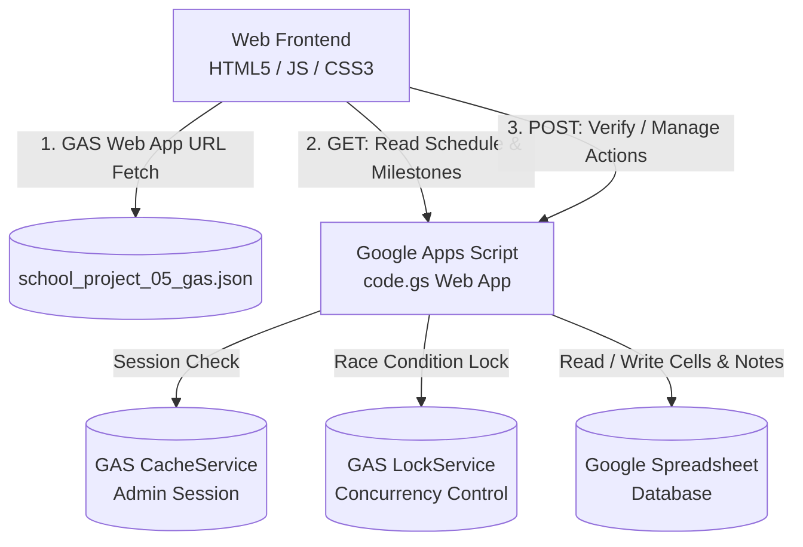

# [PRD] 성일정보고등학교 일학습병행 도제학교 스마트 통합 일정표

---

## 1. 프로젝트 개요 (Overview)

### 1.1 프로젝트 명칭
- **국문**: 성일정보고등학교 일학습병행(도제학교) 스마트 통합 일정표 (Learning Operations Intelligence)
- **버전**: v1.5 (Frontend v1.0 / Backend Code.gs)

### 1.2 개발 배경 및 목적
- **배경**: 직업계 고등학교 도제교육(일학습병행제)은 교내 교육(off-JT)과 기업 현장 훈련(OJT), 일반 학사일정 및 자격·능력평가 마일스톤이 복합적으로 교차되어 학생과 교직원이 일정을 파악하기 복잡함.
- **목적**: 
  - Google Spreadsheet 기반의 중앙 데이터 관리와 웹 캘린더 인터페이스의 실시간 연동.
  - 교내 교육(off-JT), 현장 훈련(OJT), 특별수업, 국가공휴일/휴업일의 명확한 시각화 및 이수시간 자동 집계.
  - 관리자 전용 인증 및 실시간 편집(공지사항, 일정 등록/삭제, D-Day 마일스톤 관리) 기능 제공.
  - 일정표 캡처(이미지 다운로드)를 통한 학부모 및 학생 공지 편의성 극대화.

---

## 2. 타깃 사용자 및 페르소나 (User Personas)

| 사용자 구분 | 주요 행동 및 요구사항 | 제공 기능 |
| :--- | :--- | :--- |
| **학생 / 학부모** | • 이번 달/이번 주 off-JT 및 OJT 일정 확인<br>• 다가오는 역량평가/자격시험 D-Day 확인<br>• 일정표 이미지 저장 및 휴대폰 보관 | • 월간/주간 캘린더 뷰<br>• 분류별 필터링<br>• off-JT/OJT 일수 및 이수시간 대시보드<br>• 일정표 캡처(PNG 다운로드) |
| **도제 담당 교사 / 관리자** | • 학사일정 등록, 변경 및 삭제<br>• 상단 실시간 공지 등록<br>• 주요 마일스톤(D-Day) 등록 및 관리<br>• 구글 스프레드시트와의 안전한 동기화 | • 비밀번호 기반 관리자 인증 및 세션<br>• 공지사항 실시간 업데이트<br>• 일정 추가/삭제 모달 및 셀 직관적 삭제<br>• 디데이 추가/삭제 패널 |

---

## 3. 핵심 기능 요구사항 (Functional Requirements)

### 3.1 캘린더 시각화 및 탐색 (Calendar Workspace)
- **FR-101 (월간 보기 / Month View)**: 해당 연/월의 달력을 7열(일~토) 그리드로 출력하며 이전/다음 달 잔여 일을 포함하여 렌더링.
- **FR-102 (주간 보기 / Week View - 1주간 / 2주간)**: 선택한 기준일로부터 1주일(7일) 또는 2주일(14일) 일정을 세로 확장 그리드 뷰로 렌더링.
- **FR-103 (기간 이동)**: 이전(`‹`) 및 다음(`›`) 버튼을 통해 월간(1개월), 1주간(7일), 2주간(14일) 단위로 날짜 이동.
- **FR-104 (일정 분류 및 색상 코딩)**:
  - `교내 교육 (off-JT)`: 파란색 (`--blue-offjt`)
  - `현장 훈련 (OJT)`: 빨간색 (`--red-ojt`)
  - `특별수업 (방과후)`: 녹색 (`--green-special`)
  - `특별수업 (기타 특강/캠프 등)`: 보라색 (`--purple-special`)
  - `휴업일 / 공휴일`: 연분홍/적색 (`#fff3f5`, `#c13750`)
  - `학사일정 / 일반`: 회색 (`--gray-general`)
- **FR-105 (카테고리 다중 선택 필터링 / Multi-Select Filtering)**: 전체 일정 보기 및 카테고리별 칩(학사일정, off-JT, OJT, 특별수업 등)을 2개 이상 복수로 겹쳐서 선택(다중 필터링)할 수 있는 토글 인터랙션 지원.

### 3.2 통계 및 대시보드 (Dashboard & Analytics)
- **FR-201 (off-JT 집계)**: 현재 달력 화면에 표시된 일정을 기준으로 고유 일수(Set) 및 총 이수시간 집계 (기본 7시간, `(N)` 표기 시 N시간 반영).
- **FR-202 (OJT 집계)**: 현재 달력 화면에 표시된 일정을 기준으로 고유 일수(Set) 및 총 이수시간 집계 (기본 8시간, `(N)` 표기 시 N시간 반영).
- **FR-203 (차기 마일스톤 D-Day 계산)**: 등록된 디데이 중 오늘 이후 가장 가까운 일정의 남은 일수(D-Day, D-N)와 명칭 자동 산출.

### 3.3 실시간 공지사항 (Notice)
- **FR-301**: 스프레드시트 '설정' 시트의 공지사항 텍스트를 최상단 배너에 실시간 출력.

### 3.4 일정표 캡처 및 내보내기 (Export)
- **FR-401**: 일정표 저장 버튼 클릭 시, `html2canvas`를 동적 로드하여 현재 선택된 뷰(월간/1주간/2주간)의 **순수 달력 영역 (`#calendar-workspace`)**만을 2배율 고해상도 PNG 파일(`성일정보고_달력_{월간/1주간/2주간}_{해당기간}.png`)로 즉각 다운로드. 캡처 시 저장 버튼 및 관리자 패널은 자동으로 제외.

### 3.5 관리자 보안 및 일정 관리 (Admin Operations)
- **FR-501 (관리자 인증 및 세션 지속성)**: Google Apps Script Script Properties에 등록된 `ADMIN_PASSWORD`와 일치 여부를 검증하고 토큰 발급. 브라우저 로컬 스토리지(`localStorage`)에 저장하여 사용자가 명시적으로 '로그아웃'하기 전까지 페이지 새로고침 후에도 관리자 모드를 유지.
- **FR-502 (공지 업데이트)**: 공지 텍스트를 즉시 '설정' 시트 B1 셀에 반영.
- **FR-503 (마일스톤 관리)**: 디데이 시트에 목표 날짜, 명칭, 고유 ID(UUID) 추가 및 삭제.
- **FR-504 (신규 일정 등록)**: 날짜, 일정 분류, 명칭, 이수시간(off-JT/OJT 선택 시 기본값 또는 1~24 커스텀)을 입력받아 해당 연.월 시트의 해당 일/분류 셀에 줄바꿈 추가 및 Note 메타데이터 동기화.
- **FR-505 (일정 삭제)**: 특정 일자의 특정 일정을 선택하여 시트 셀 및 Note 메타데이터에서 안전하게 제거.
- **FR-506 (인라인 일정 수정)**: 날짜 클릭 팝업 모달에서 기존 일정의 명칭, 분류, 이수시간을 즉시 수정하여 시트와 동기화.
- **FR-507 (관리자 편집 도구 팝업 모달)**: 상단 히어로 영역 '관리자 로그인' 버튼 옆에 '관리자 편집도구' 버튼 제공 (로그인 시 `#admin-tools-modal` 팝업 창 즉시 오픈, 미로그인 시 로그인 모달 인증 완료 후 자동 오픈). 팝업 내에서 공지사항, D-Day, 신규 일정을 탭으로 전환하며 관리 가능.

---

## 4. 데이터 및 백엔드 아키텍처 (System Architecture)



### 4.1 데이터 저장 모델 (Spreadsheet Schema)

#### 1) 월별 시트 (`YYYY.M` 또는 `YYYY.MM`, 예: `2026.3`)
- **A열**: `일` (1 ~ 31)
- **B열**: `요일`
- **C열 이후**: 카테고리 헤더 (`학사일정`, `off-JT`, `OJT`, `특별수업`, `국가공휴일`, `휴업일` 등)
- **셀 데이터 저장 방식**:
  - Cell Value: 여러 일정일 경우 `\n` 개행 문자로 연결 (예: `기계제도 실습 (7)\n도제 오리엔테이션`)
  - Cell Note: JSON 형식의 고유 ID 메타데이터 관리
    ```json
    {
      "version": 1,
      "items": [
        { "id": "4f9b8c2e-...", "title": "기계제도 실습 (7)" },
        { "id": "7a8b9c0d-...", "title": "도제 오리엔테이션" }
      ]
    }
    ```

#### 2) `설정` 시트
- **A1**: `Notice`
- **B1**: 공지사항 내용 텍스트 (최대 500자)

#### 3) `디데이` 시트
- **A열**: `목표 날짜` (`YYYY-MM-DD` 포맷)
- **B열**: `디데이 명칭` (최대 200자)
- **C열 (__id)**: `일정 식별자` (UUID, 열 숨김 처리)

---

## 5. API 명세 (API Specifications)

### 5.1 GET Request (데이터 조회)
- **URL**: GAS Web App Exec URL
- **Response**:
```json
{
  "notice": "2026학년도 1학기 도제과정 안내",
  "types": ["학사일정", "off-JT", "OJT", "특별수업", "국가공휴일", "휴업일"],
  "milestones": [
    { "id": "uuid-string", "date": "2026-04-15", "title": "1차 도제역량평가" }
  ],
  "data": {
    "2026.3": [
      { "id": "uuid-string", "day": 2, "type": "학사일정", "title": "개학식 및 입학식" },
      { "id": "uuid-string", "day": 3, "type": "off-JT", "title": "네트워크 기초 (7)" }
    ]
  }
}
```

### 5.2 POST Request (관리자 작업)
- **헤더**: `Content-Type: text/plain`
- **공통 응답**: `{ "success": true/false, "message"?: string, ... }`

| Action | 주요 파라미터 | 설명 |
| :--- | :--- | :--- |
| `verify` | `password` | 비밀번호 검증 후 30분 유효 세션 토큰 반환 |
| `logout` | `token` | 관리자 세션 토큰 캐시 즉시 파기 |
| `update_notice` | `token`, `newNotice` | 상단 공지사항 수정 |
| `add_dday` | `token`, `date`, `title` | 신규 디데이 마일스톤 등록 |
| `delete_dday` | `token`, `id`, `date`, `title` | 등록된 디데이 마일스톤 삭제 |
| `add_event` | `token`, `date`, `type`, `title`, `hours` | 신규 일정 등록 (이수시간 포함) |
| `update_event` | `token`, `eventId`, `oldDate`, `oldType`, `oldTitle`, `newDate`, `newType`, `newTitle`, `hours` | 등록된 일정 수정 및 셀/Note 메타데이터 갱신 |
| `delete_event`| `token`, `date`, `type`, `title`, `eventId` | 특정 날짜/분류의 일정 배지 삭제 |

---

## 6. 비기능적 요구사항 (Non-Functional Requirements)

1. **보안성 (Security)**:
   - 관리자 비밀번호는 클라이언트 소스코드에 일체 노출되지 않으며 GAS Script Properties로 분리.
   - 모든 수정/삭제 API는 세션 토큰 유효성 검증(`assertAdminSession_`)을 필수로 거침.
2. **동시성 및 데이터 정합성 (Concurrency & Integrity)**:
   - GAS의 `LockService.getScriptLock()`을 활용하여 다중 관리자 요청 시 10초 대기 락을 걸어 시트 셀 덮어쓰기 방지.
   - 각 일정 및 마일스톤에 고유 UUID를 부여하고 Note에 버전 메타데이터를 저장하여 삭제 시 타겟 정확도 보장.
3. **접근성 및 반응형 UI (Accessibility & Responsive Design)**:
   - 모바일(320px~), 태블릿(640px~), 데스크톱(960px~) 전 기기 완벽 대응.
   - `aria-live`, `aria-selected`, `aria-label`, `skip-link` 등 웹 접근성 표준 준수.
   - `prefers-reduced-motion` 미디어 쿼리 대응으로 모션 민감 사용자 배려.
4. **사용자 경험 (UX)**:
   - Glassmorphism 기반의 모던 UI 스타일 적용.
   - 스켈레톤/로딩 마스크를 통한 데이터 로딩 피드백.
   - 이미지 다운로드 시 불필요한 관리자 UI 영역 자동 숨김 처리.
